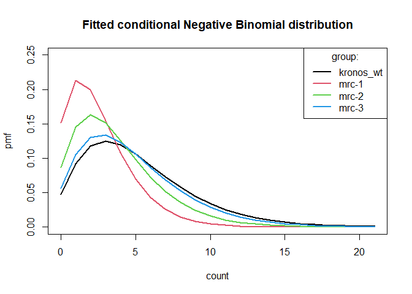

Statistics for figure 10 - granules per chloroplast
================
Jiawen Chen/Statistics Services Ltd (Reading, UK)
2022-09-23

We consulted Statistics Services Ltd (Reading, UK) for the analysis of
our count data regarding granule per chloroplast, obtained from counting
from light microscopy images of Arabidopsis leaf sections.

We used mixed effects models for this, in order to take into account
both the three biological replicates for each genotype (random effect),
and the distribution of granule number chloroplast for each genotype. We
tried a Poisson model first, but this showed overdispersion so we then
proceeded with negative binomial models, which were not overdispersed.

\#Analysis 1: Non-backcrossed lines: WT Kronos, *mrc-1*, *mrc-2*,
*mrc-3*

Importing and sorting data

``` r
dat<-read.csv("2021_gpc_nonbackcrossed.csv")
dat$rep<-factor(dat$rep)
dat$group<-factor(dat$group)
dat$counts.f<-ordered(dat$counts)
colnames(dat)

#Making a unique rep id column for 3 biological reps in each of 4 genotype groups
dat$rep.id<-dat$rep:dat$group
length(levels(dat$rep.id))
head(dat)
# Disaggregating the data to use for fitting functions
dat.disag<-dat[rep(1:nrow(dat),dat[,2]),-2]
head(dat.disag)
aggregate(dat$freq~dat$rep.id,FUN=sum)
aggregate(dat.disag$counts~dat.disag$rep.id,FUN=length)
```

## Mixed effect models, fitted by maximum likelihood. Negative binomial regression.

``` r
## Default repo
local({r <- getOption("repos")
       r["CRAN"] <- "http://cran.r-project.org" 
       options(repos=r)
})

install.packages("MASS");
library(MASS)
nb0<-glm.nb(counts~1,data=dat.disag) #Must be fitted before loading GLMMadaptive to prevent masking

install.packages("GLMMadaptive")
library(GLMMadaptive); library(emmeans)
```

``` r
nb1<-mixed_model(counts~1,~1|rep.id,data=dat.disag,family=negative.binomial)
nb2<-mixed_model(counts~group,~1|rep.id,data=dat.disag,family=negative.binomial)
anova(nb1,nb0) #Test of random effect component, resulting p-value must be halved #ignore warning, it's caused by masking
```

    ## Warning in anova.MixMod(nb1, nb0): it seems that the two objects represent model
    ## with different families; are the models nested? If not, you should set 'test' to
    ## FALSE.

    ## 
    ##          AIC      BIC  log.Lik    LRT df p.value
    ## nb1 14124.69 14126.15 -7059.35                  
    ## nb0 14437.64 14449.61 -7216.82 314.95  1 <0.0001

We see a significant random effect of the biological replicates. Now we
proceed to testing the fixed effect of the genotype adjusted for random
effect.

``` r
anova(nb1,nb2) 
```

    ## 
    ##          AIC      BIC  log.Lik   LRT df p.value
    ## nb1 14124.69 14126.15 -7059.35                 
    ## nb2 14108.10 14111.01 -7048.05 22.59  3 <0.0001

We see a significant fixed effect adjusted for random effect. Now we
proceed to means and pairwise comparisons.

``` r
# Must regrid, or the argument type is ignored
nb2r<-update(ref_grid(nb2),tran='log')
emmeans(nb2r,~group,type='response') # predicted mean count
```

    ##  group     response    SE  df asymp.LCL asymp.UCL
    ##  kronos_wt     5.21 0.344 Inf      4.58      5.93
    ##  mrc-1         2.61 0.179 Inf      2.28      2.98
    ##  mrc-2         3.75 0.251 Inf      3.29      4.27
    ##  mrc-3         4.77 0.317 Inf      4.19      5.44
    ## 
    ## Confidence level used: 0.95 
    ## Intervals are back-transformed from the log scale

``` r
pairs(emmeans(nb2r,~group,type='response'),inf=T)
```

    ##  contrast            ratio     SE  df asymp.LCL asymp.UCL null z.ratio p.value
    ##  kronos_wt / (mrc-1) 1.997 0.1901 Inf     1.564     2.551    1   7.271  <.0001
    ##  kronos_wt / (mrc-2) 1.390 0.1307 Inf     1.091     1.769    1   3.497  0.0027
    ##  kronos_wt / (mrc-3) 1.091 0.1021 Inf     0.858     1.387    1   0.929  0.7893
    ##  (mrc-1) / (mrc-2)   0.696 0.0667 Inf     0.544     0.890    1  -3.783  0.0009
    ##  (mrc-1) / (mrc-3)   0.546 0.0521 Inf     0.427     0.698    1  -6.336  <.0001
    ##  (mrc-2) / (mrc-3)   0.785 0.0741 Inf     0.616     1.000    1  -2.564  0.0506
    ## 
    ## Confidence level used: 0.95 
    ## Conf-level adjustment: tukey method for comparing a family of 4 estimates 
    ## Intervals are back-transformed from the log scale 
    ## P value adjustment: tukey method for comparing a family of 4 estimates 
    ## Tests are performed on the log scale

``` r
pairs(emmeans(nb2r,~group,type='response'),rev=T,inf=T)
```

    ##  contrast            ratio     SE  df asymp.LCL asymp.UCL null z.ratio p.value
    ##  (mrc-1) / kronos_wt 0.501 0.0476 Inf     0.392     0.639    1  -7.271  <.0001
    ##  (mrc-2) / kronos_wt 0.720 0.0677 Inf     0.565     0.916    1  -3.497  0.0027
    ##  (mrc-2) / (mrc-1)   1.437 0.1379 Inf     1.124     1.839    1   3.783  0.0009
    ##  (mrc-3) / kronos_wt 0.917 0.0858 Inf     0.721     1.166    1  -0.929  0.7893
    ##  (mrc-3) / (mrc-1)   1.831 0.1748 Inf     1.433     2.340    1   6.336  <.0001
    ##  (mrc-3) / (mrc-2)   1.274 0.1202 Inf     1.000     1.623    1   2.564  0.0506
    ## 
    ## Confidence level used: 0.95 
    ## Conf-level adjustment: tukey method for comparing a family of 4 estimates 
    ## Intervals are back-transformed from the log scale 
    ## P value adjustment: tukey method for comparing a family of 4 estimates 
    ## Tests are performed on the log scale

``` r
# Illustrate fitted conditional distributions
theta<-exp(nb2$phis); theta 
```

    ##    phi_1 
    ## 3.052571

``` r
# Note arg size = theta 
curve(dnbinom(x,size=theta,mu=5.21),0,21,22,lwd=2,ylim=c(0,.25),xlab='count',ylab='pmf')
curve(dnbinom(x,size=theta,mu=2.61),0,21,22,lwd=2,add=T,col=2)
curve(dnbinom(x,size=theta,mu=3.75),0,21,22,lwd=2,add=T,col=3)
curve(dnbinom(x,size=theta,mu=4.77),0,21,22,lwd=2,add=T,col=4)
legend('topright',levels(dat$group),lwd=2,col=1:4,title='group:')
title('Fitted conditional Negative Binomial distribution')
```

<!-- -->

Finally, we check that the data is not overdispersed. We use an informal
goodness of fit criterion, e.g. from [Gbur et al
2012](https://acsess.onlinelibrary.wiley.com/doi/book/10.2134/2012.generalized-linear-mixed-models),
section 5.4, page 128. Sum of conditional Pearson residuals
squared/model DF. A ratio \>\>1 suggests more observed variance than
expected from a Poisson/negative binomial.

``` r
dat.disag$pred.ss<-predict(nb2,dat.disag,type='sub')
dat.disag$pearson<-(dat.disag$counts-dat.disag$pred.ss)/sqrt(dat.disag$pred.ss+dat.disag$pred.ss^2/theta)
pearchi2<-sum(dat.disag$pearson^2)
pearchi2/nobs(nb2) 
```

    ## [1] 0.8729055

There was overdispersion when we used a Poisson model, but no
overdispersion with this negative binomial model.

# Analysis 2: Backcrossed lines: WT Kronos, *mrc-1*, *mrc-1* BC2 *aabb*, *mrc-1* BC2 AABB

We did the same analysis on these lines, from the file
“2021_gpc_backcrossed.csv”. Details of analysis identical to above,
showing the mean and pairwise comparison outputs below.

``` r
emmeans(nb2r2,~group,type='response') # Predicted mean count
```

    ##  group       response    SE  df asymp.LCL asymp.UCL
    ##  mrc1            2.88 0.192 Inf      2.53      3.28
    ##  mrc1_BC2        2.97 0.196 Inf      2.61      3.38
    ##  mrc1_BC2_NS     3.55 0.233 Inf      3.13      4.04
    ##  WT              4.71 0.306 Inf      4.15      5.35
    ## 
    ## Confidence level used: 0.95 
    ## Intervals are back-transformed from the log scale

``` r
pairs(emmeans(nb2r2,~group,type='response'),inf=T)
```

    ##  contrast               ratio     SE  df asymp.LCL asymp.UCL null z.ratio
    ##  mrc1 / mrc1_BC2        0.971 0.0910 Inf     0.763     1.235    1  -0.318
    ##  mrc1 / mrc1_BC2_NS     0.810 0.0756 Inf     0.637     1.030    1  -2.256
    ##  mrc1 / WT              0.612 0.0569 Inf     0.482     0.777    1  -5.285
    ##  mrc1_BC2 / mrc1_BC2_NS 0.835 0.0776 Inf     0.657     1.060    1  -1.943
    ##  mrc1_BC2 / WT          0.630 0.0584 Inf     0.497     0.800    1  -4.982
    ##  mrc1_BC2_NS / WT       0.755 0.0696 Inf     0.596     0.957    1  -3.048
    ##  p.value
    ##   0.9889
    ##   0.1086
    ##   <.0001
    ##   0.2100
    ##   <.0001
    ##   0.0123
    ## 
    ## Confidence level used: 0.95 
    ## Conf-level adjustment: tukey method for comparing a family of 4 estimates 
    ## Intervals are back-transformed from the log scale 
    ## P value adjustment: tukey method for comparing a family of 4 estimates 
    ## Tests are performed on the log scale

``` r
pairs(emmeans(nb2r2,~group,type='response'),rev=T,inf=T)
```

    ##  contrast               ratio     SE  df asymp.LCL asymp.UCL null z.ratio
    ##  mrc1_BC2 / mrc1         1.03 0.0966 Inf     0.810      1.31    1   0.318
    ##  mrc1_BC2_NS / mrc1      1.23 0.1152 Inf     0.971      1.57    1   2.256
    ##  mrc1_BC2_NS / mrc1_BC2  1.20 0.1114 Inf     0.943      1.52    1   1.943
    ##  WT / mrc1               1.64 0.1521 Inf     1.287      2.08    1   5.285
    ##  WT / mrc1_BC2           1.59 0.1472 Inf     1.251      2.01    1   4.982
    ##  WT / mrc1_BC2_NS        1.32 0.1222 Inf     1.045      1.68    1   3.048
    ##  p.value
    ##   0.9889
    ##   0.1086
    ##   0.2100
    ##   <.0001
    ##   <.0001
    ##   0.0123
    ## 
    ## Confidence level used: 0.95 
    ## Conf-level adjustment: tukey method for comparing a family of 4 estimates 
    ## Intervals are back-transformed from the log scale 
    ## P value adjustment: tukey method for comparing a family of 4 estimates 
    ## Tests are performed on the log scale

\`\`\`
